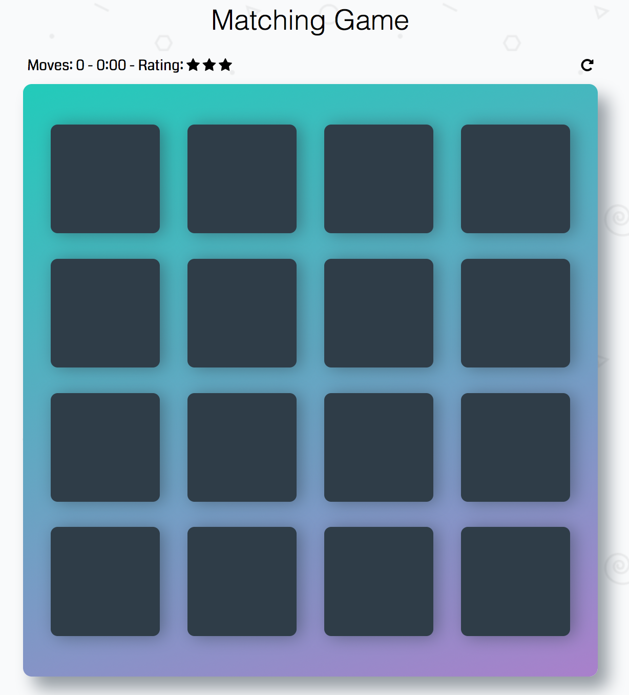
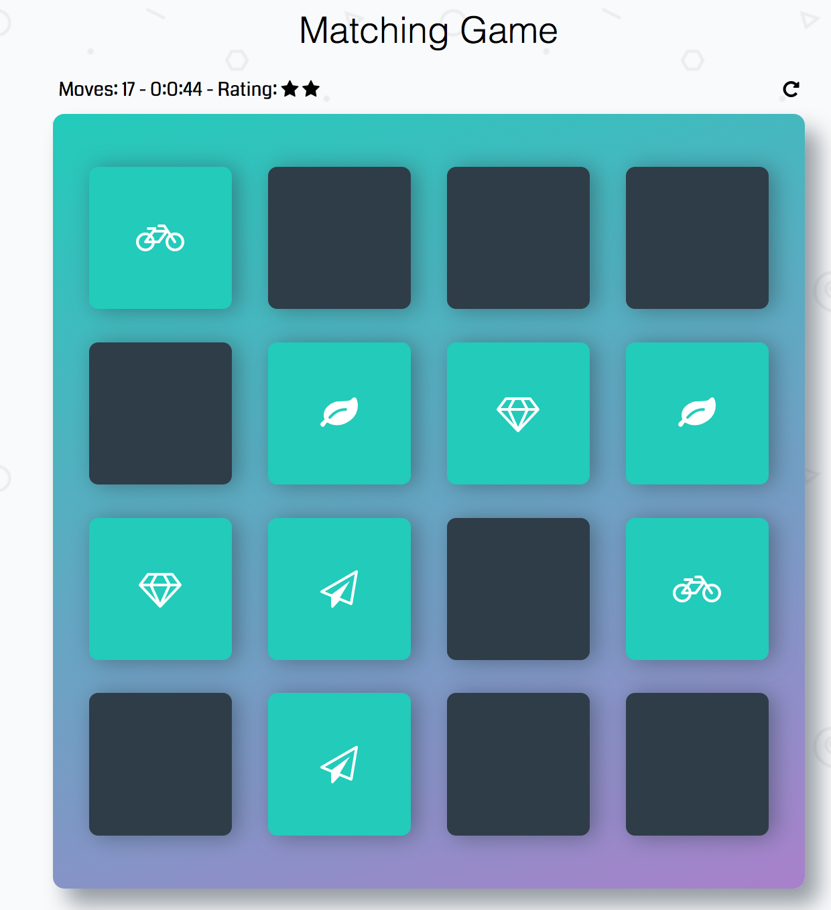
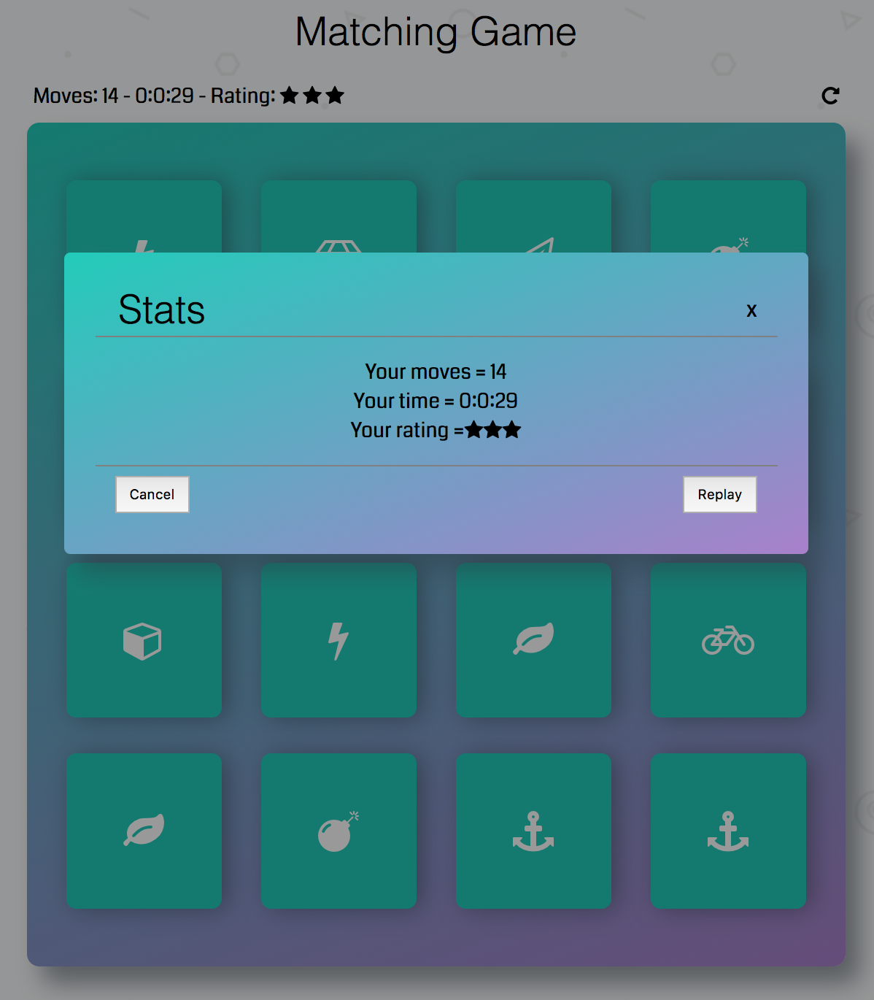

# Memory Game Project

This game has been developed as part of the third module in Udacity's FEND program. The purpose of this project was to demonstrate mastery of HTML, CSS and Javascript. 

## Table of Contents

* [How To Play](#howtoplay)
	* [Loading the Game](#loading-the-game)
	* [Playing the Game](#playing-the-game)
	* [Winning the Game](#winning-the-game)
	* [Screenshots](#screenshots)
* [Resources](#resources)
	* [Udacity Resources](#udacity-resources)

## How To Play 
This is a memory game based on matching cards in pairs. 
Follow the instructions below to start and play the game. 

### Loading the Game
You can load the game in the following two ways:

- Clone or download the **[repo](https://github.com/fea1993/fend-memory-game.git)** and open index.html, or;
- Play on github.io: **[Memory Game](https://fea1993.github.io/fend-memory-game/)**

### Playing the Game
The game includes 16 cards and 8 pairs. Each pair of cards has their own unique icon on its hidden side. 

Each turn: 
* Click on a card, reveal its icon and remember its position in the grid. 
* Click on a new card and see if it match
	* If the two flipped cards match, both cards turn green and stay flipped
	* If the cards do not match, both cards return to their hidden state
* The game ends once all cards are matched correctly into 8 pairs

### Winning the Game
As the game ends, a box will pop-up showing the: 

- number of moves taken to pair the 16 cards. A move is counted everytime two cards have been turned.  
- time it has taken to pair the 16 cards
- star-based rating of one's performance
	- 3 stars = less than than 16 moves;
	- 2 stars = between 16 and 20 moves;
	- 1 star = more than 20 moves

This means that the goal of the game is to pair all cards with fewest moves possible and as fast as possible. Keep track of your progress and improve your performance by noting your number of moves, time-spend and resulting star-rating. 

### Screenshots

 

## Resources
The following section will outline the resources used to develop this memory game.

### Udacity Resources
This project builds upon the starter code provided by Udacity to assist with HTML, CSS, and shuffle function

Project Guidelines:
- [Project Description](https://classroom.udacity.com/nanodegrees/nd016beta/parts/45080fba-9129-4bd9-869f-548be080accf/modules/677caa06-55d6-444e-a853-08627c5516a7/lessons/4227cbf4-f6ce-4798-a7e5-b1ce3b9e7c33/concepts/0a38769e-8e23-4e3f-9482-d8d1aa80fbb6)
- [Project Rubric](https://review.udacity.com/#!/rubrics/591/view)

